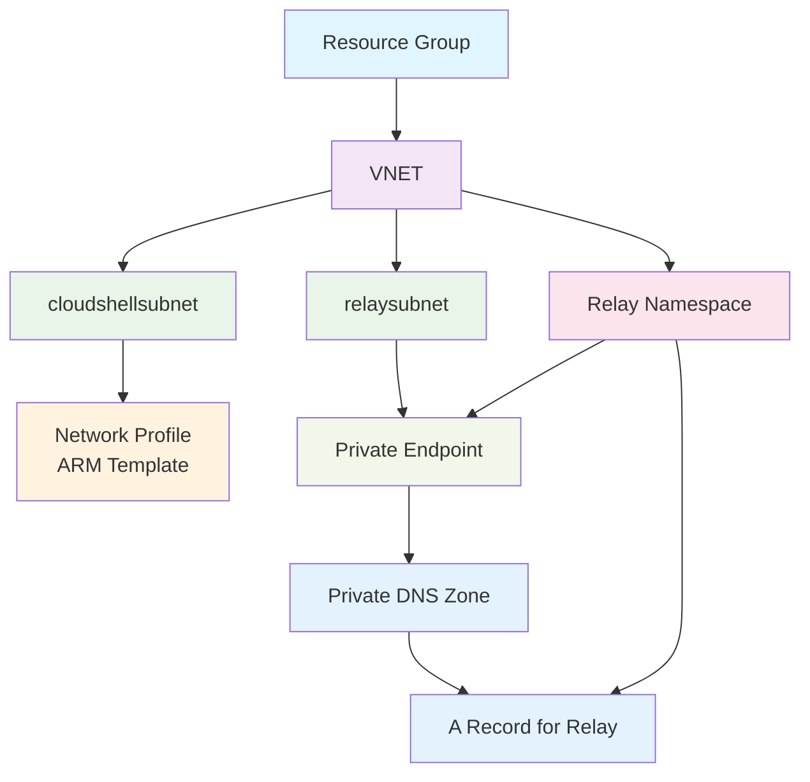

# Workflows

## Workflow 1: Set Up Cloud Shell in a VNET

1. Ask the user for a region. Do not assume a region. All resources from Step 2 must be created in that region ONLY.
2.  🛠️ Create a resource group in that region
3. In the resource group:
  - 🌐 Create a VNET.
  - 🧩 Create two subnets (use default IP ranges):
    - `cloudshellsubnet` (for container groups) (for container groups) and delegate Microsoft.ContainerInstance/containerGroups to cloudshellsubnet
    - `relaysubnet`
  - 🏗️ Create a network profile using the `network-profile-template.json` file in this folder. In that file substitute `<FILL IN SUBNET RESOURCE ID>` with the actual resource ID of `cloudshellsubnet`.
    - 🏗️ Deploy the network profile ARM template.
  - 🔍 Create a relay namespace.
  - 🛡️ Provide network contributor access to `6bb8e274-af5d-4df2-98a3-4fd78b4cafd9` (Azure Container Instance Service) for network profile.
  - 🛡️ Provide contributor access to `6bb8e274-af5d-4df2-98a3-4fd78b4cafd9` (Azure Container Instance Service) for Azure Relay.
  - 🔒 Create a private endpoint for `relaysubnet` and link it to a private DNS zone. Add an A record for the relay namespace in the private DNS zone.
  - 📄 Add a NAT gateway with a public IP
  - 🧩 Associate it with cloud shell subnet
  - 🏦 Create a storage account and a file share called testshare
  - 🔐 Add a private endpoint for the storage account

## Cleanup

- 🗑️ Delete the resource group along with all its resources, ensuring that dependencies are properly handled to avoid deletion errors.

---

## Diagram

