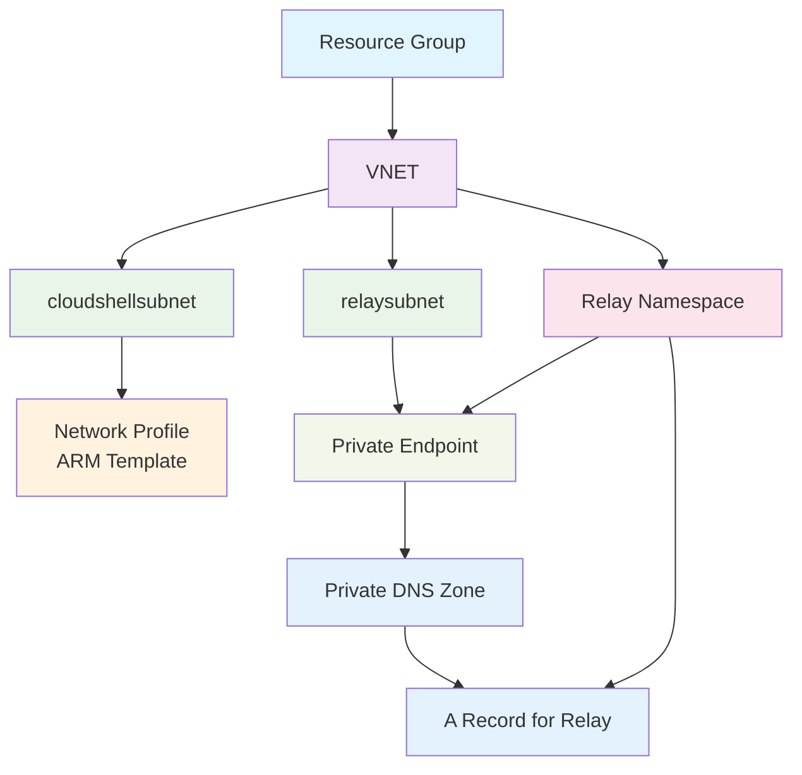

# Workflows

## Workflow 1: Set Up Cloud Shell in a VNET

1. Choose a location.
2. Make a resource group.
3. In the resource group:
  - Make a VNET.
  - Make two subnets (use default IP ranges):
    - `cloudshellsubnet` (for container groups)
    - `relaysubnet`
  - Make a network profile using an ARM template. Use the resource ID of `cloudshellsubnet`.
  - Use the network profile ARM template.
  - Make a relay namespace.
  - Make a private endpoint for `relaysubnet` and link it to a private DNS zone.
  - Add an A record for the relay namespace in the private DNS zone.

## Workflow 2: Cleanup

- Delete the resource group created above.

---

## Diagram

